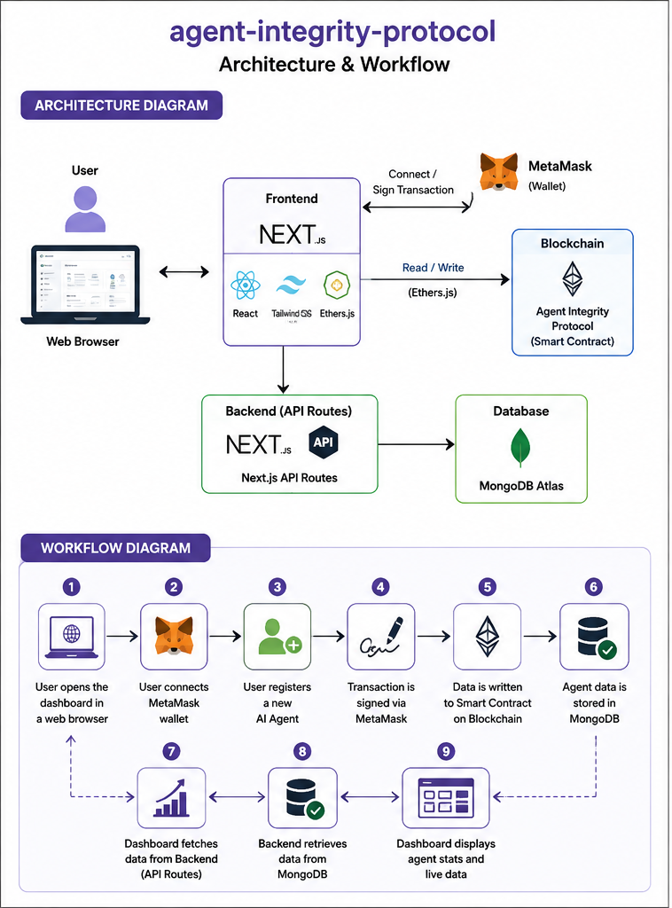

# 🛡️ Agent Integrity Protocol

A full-stack AI Agent Integrity Dashboard built with Next.js, MongoDB, MetaMask, and Solidity smart contracts. This project enables secure AI agent registration, execution monitoring, and blockchain-based verification.

---

## 🚀 Features

- 🔐 MetaMask Wallet Integration
- ⛓️ Smart Contract Interaction (Solidity)
- 🤖 AI Agent Registration
- 📊 Interactive Dashboard
- 🗄️ MongoDB Atlas Integration
- 📈 Agent Statistics
- ⚡ Next.js API Routes
- 🎨 Modern Responsive UI

---

## 🛠️ Tech Stack

- Next.js 16
- React
- TypeScript
- Tailwind CSS
- MongoDB Atlas
- Mongoose
- Ethers.js
- MetaMask

---

## 📂 Project Structure
app/
components/
hooks/
lib/
models/
public/
styles/

---

## ⚙️ Installation

Clone the repository

```bash
git clone https://github.com/Sanaya77/agent-integrity-protocol.git
```

Install dependencies

```bash
npm install
```

Create a `.env.local`

```env
MONGODB_URI=your_mongodb_uri
JWT_SECRET=your_secret
```

Run the development server

```bash
npm run dev
```

Open:

```
http://localhost:3000
```
🔗 Blockchain Integration

This frontend communicates with the Agent Integrity Protocol smart contract using:

MetaMask
Ethers.js
Hardhat Local Network
📸 Features
Register AI Agent
Connect Wallet
Dashboard Analytics
Blockchain Transaction Signing
MongoDB Data Storage
🌱 Future Improvements
Execution Proof Storage
Dispute Resolution
Trust Score Updates
IPFS Integration
Sepolia Testnet Deployment

## Architecture and Workflow


👩‍💻 Author

Sanaya Y. Kulkarni

GitHub:
https://github.com/Sanaya77
